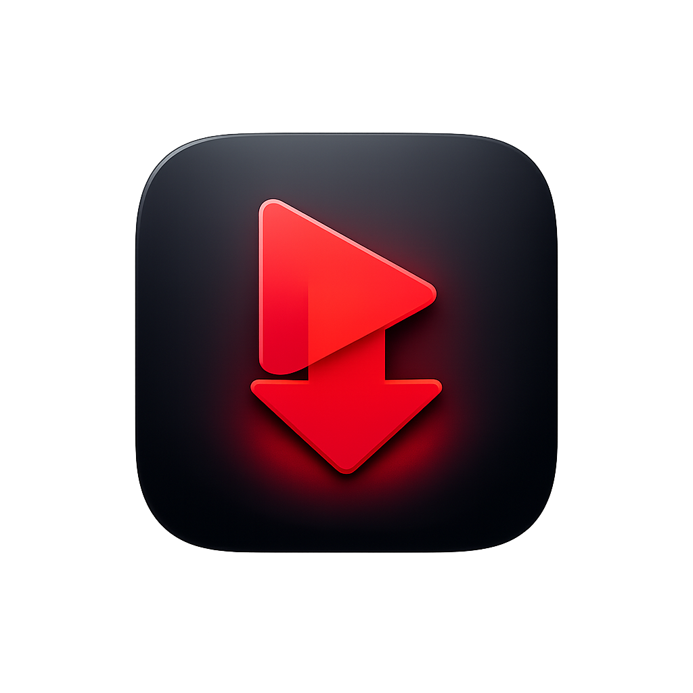
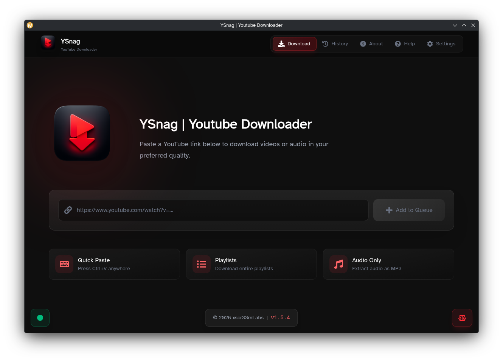
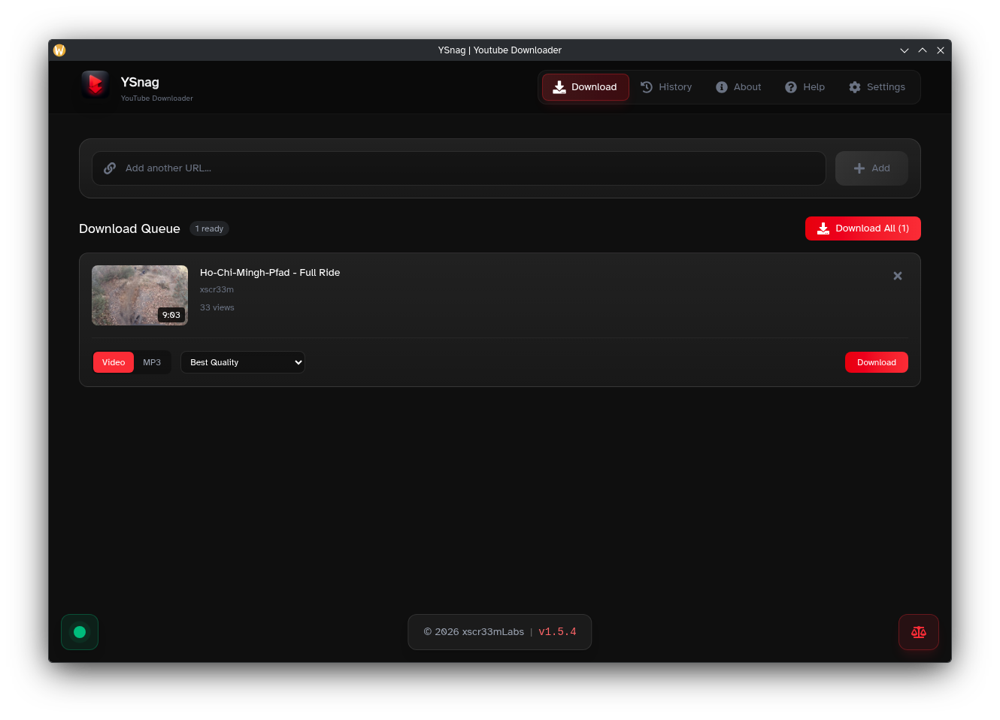
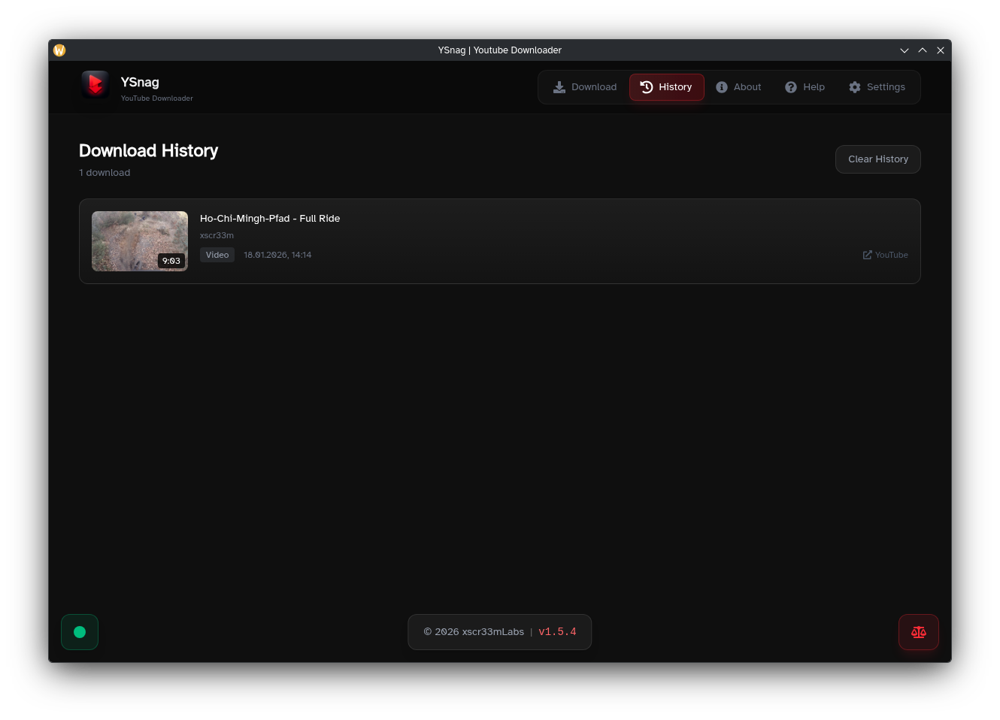
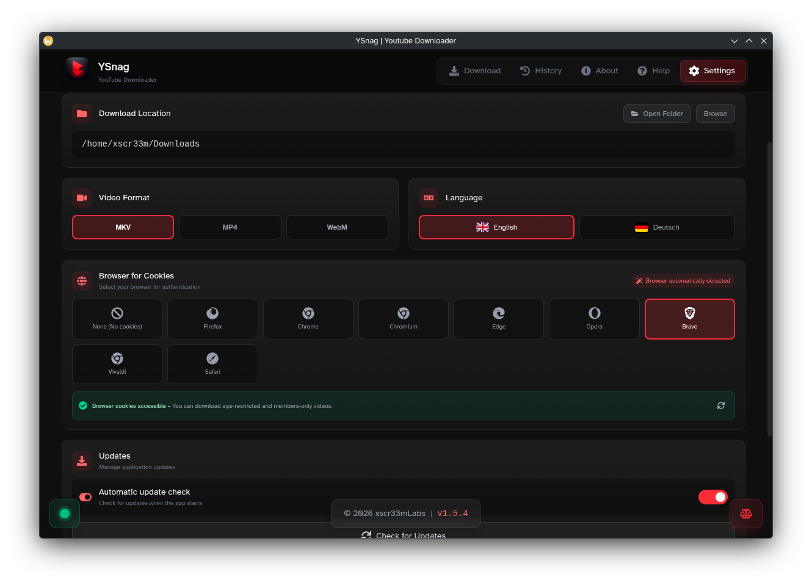

<p align="center">
  
</p>

<h1 align="center">YSnag</h1>

<p align="center">
  <strong>A modern, open-source and multi-platform yt-dlp GUI wrapper</strong>
</p>

<p align="center">
  <a href="https://github.com/xscr33m/YSnag/releases/latest">
    
  </a>
  <a href="https://github.com/xscr33m/YSnag/releases">
    
  </a>
  <a href="LICENSE">
    
  </a>
  <a href="https://github.com/xscr33m/YSnag/stargazers">
    
  </a>
</p>

<p align="center">
  <a href="#features">Features</a> •
  <a href="#installation">Installation</a> •
  <a href="#development">Development</a> •
  <a href="#building">Building</a> •
  <a href="#contributing">Contributing</a> •
  <a href="#license">License</a>
</p>

---

## ✨ Features

- 🚀 **Zero Configuration (Windows)** — Just install and start downloading. All dependencies (yt-dlp, FFmpeg, Node.js) are automatically installed on first launch
- 🎯 **User-Friendly Interface** — Modern, intuitive UI that makes yt-dlp accessible to everyone — no command line required
- 🎬 **Video & Audio Downloads** — Download videos in multiple resolutions or extract audio as MP3
- 📋 **Queue System** — Add multiple videos and download them sequentially
- 🎵 **Playlist Support** — Download entire YouTube playlists with one click
- 🍪 **Browser Cookie Integration** — Access age-restricted and private videos via browser authentication
- 🌍 **Multi-language** — Available in English and German
- 🔄 **Auto-Updates** — Automatic updates via GitHub Releases
- 🖥️ **Cross-Platform** — Works on Windows and Linux

## 📸 Screenshots

<table>
  <tr>
    <td align="center">
      <br>
      <em>Download Tab</em>
    </td>
    <td align="center">
      <br>
      <em>Queue System</em>
    </td>
  </tr>
  <tr>
    <td align="center">
      <br>
      <em>Download History</em>
    </td>
    <td align="center">
      <br>
      <em>Settings</em>
    </td>
  </tr>
</table>

## 📥 Installation

### Download Pre-built Binaries

Download the latest release for your platform:

| Platform    | Download                                                                  |
| ----------- | ------------------------------------------------------------------------- |
| **Windows** | [YSnag-x.x.x-Setup.exe](https://github.com/xscr33m/YSnag/releases/latest) |
| **Linux**   | [YSnag-x.x.x.AppImage](https://github.com/xscr33m/YSnag/releases/latest)  |

### Prerequisites

#### Windows (Auto-installed)

YSnag automatically downloads and installs required dependencies on first launch:

- **yt-dlp** — Core download engine
- **FFmpeg** — Audio/video processing
- **Node.js** — Required for YouTube extraction

> Dependencies are installed to `%LOCALAPPDATA%\ysnag\bin`

#### Linux (Manual installation required)

Install the following packages using your distribution's package manager:

**Arch Linux / Manjaro:**

```bash
sudo pacman -S yt-dlp ffmpeg nodejs npm
```

**Debian / Ubuntu:**

```bash
sudo apt install yt-dlp ffmpeg nodejs npm
```

**Fedora:**

```bash
sudo dnf install yt-dlp ffmpeg nodejs npm
```

> **Tip:** The app will show which dependencies are missing in the status indicator (bottom-left corner)

## 🛠️ Development

### Prerequisites

- [Node.js](https://nodejs.org/) v18+
- [npm](https://www.npmjs.com/) v9+
- [yt-dlp](https://github.com/yt-dlp/yt-dlp) (for development)
- [FFmpeg](https://ffmpeg.org/) (for development)

### Setup

```bash
# Clone the repository
git clone https://github.com/xscr33m/YSnag.git
cd YSnag

# Install all dependencies and start full development app (browser mode)
npm run dev
```

### Available Scripts

| Command                | Description                        |
| ---------------------- | ---------------------------------- |
| `npm run dev`          | Start server + Vite (browser mode) |
| `npm run dev:electron` | Full Electron app with DevTools    |
| `npm run server`       | Express server only (port 3001)    |
| `npm run client`       | Vite dev server only (port 5173)   |

## 🏗️ Building

### Linux

```bash
npm run build:linux
# Output: _RELEASE/YSnag-x.x.x.AppImage
```

### Windows

> ⚠️ **Important:** Build on native Windows, not WSL or Wine

```bash
npm run build:win
# Output: _RELEASE/YSnag-x.x.x-Setup.exe
```

## 🏛️ Architecture

YSnag uses a three-layer architecture:

```
┌─────────────────────────────────────────────────────────┐
│                    Electron (Main)                      │
│              electron/main.js, preload.js               │
├─────────────────────────────────────────────────────────┤
│                   Express Server                        │
│                  server/index.js                        │
│              REST API + yt-dlp spawning                 │
├─────────────────────────────────────────────────────────┤
│                   React Frontend                        │
│           client/src (TypeScript + Vite)                │
│                 Tailwind CSS styling                    │
└─────────────────────────────────────────────────────────┘
```

| Layer        | Stack                                | Purpose                           |
| ------------ | ------------------------------------ | --------------------------------- |
| **Electron** | CommonJS, electron-updater           | Main process, IPC, auto-updates   |
| **Server**   | Express 5, port 3001                 | REST API, spawns yt-dlp processes |
| **Client**   | React 19, TypeScript, Vite, Tailwind | UI, state management, polling     |

## 🤝 Contributing

Contributions are welcome! Please read the following before contributing:

1. Fork the repository
2. Create a feature branch (`git checkout -b feature/amazing-feature`)
3. Commit your changes (`git commit -m 'Add amazing feature'`)
4. Push to the branch (`git push origin feature/amazing-feature`)
5. Open a Pull Request

### Code Style

- **Server:** CommonJS (no ES modules)
- **Client:** TypeScript with strict mode
- **Styling:** Tailwind CSS v4 with dark glassmorphism theme
- **i18n:** All UI text must be in both `en.json` and `de.json`

## 📜 License

This project is licensed under the **GNU General Public License v3.0** — see the [LICENSE](LICENSE) file for details.

### What this means:

- ✅ You can use, modify, and distribute this software
- ✅ You can create derivative works (forks)
- ⚠️ Any derivative work must also be licensed under GPL v3
- ⚠️ You must disclose the source code of derivative works
- ⚠️ You must include the original copyright and license
- ❌ You may NOT use the "YSnag" name or branding (see below)

### ⚖️ Trademark Policy

**"YSnag"**, the YSnag logo, and associated branding are **trademarks of xscr33mLabs** and are NOT covered by the GPL license.

| Allowed                                 | Not Allowed                                  |
| --------------------------------------- | -------------------------------------------- |
| ✅ Fork the code for personal use       | ❌ Distribute forks using "YSnag" name       |
| ✅ Modify and redistribute under GPL    | ❌ Use YSnag logo in derivative products     |
| ✅ Reference "based on YSnag" with link | ❌ Sell software using YSnag branding        |
| ✅ Contribute to this repository        | ❌ Imply official endorsement by xscr33mLabs |

**If you create a derivative work**, you must:

1. Choose a different name for your project
2. Create your own branding/logo
3. Remove all references to "YSnag" except attribution (e.g., "Based on YSnag by xscr33mLabs")

This policy protects users from confusion and prevents malicious actors from distributing modified versions under the original name. For the full trademark policy, see [TRADEMARK.md](TRADEMARK.md). For inquiries, contact: **support@xscr33mlabs.com**

## 🙏 Acknowledgments

- [yt-dlp](https://github.com/yt-dlp/yt-dlp) — The powerful download engine behind YSnag
- [Electron](https://www.electronjs.org/) — Cross-platform desktop framework
- [React](https://react.dev/) — UI library
- [Tailwind CSS](https://tailwindcss.com/) — Utility-first CSS framework
- [FFmpeg](https://ffmpeg.org/) — Audio/video processing

## ⚠️ Disclaimer & Intended Use

YSnag was created with a specific purpose in mind: **allowing content creators to download their own videos from YouTube** without requiring a YouTube Premium subscription.

### Why this app exists

- 📹 **Recover your own content** — If you've lost local copies of videos you uploaded, YSnag helps you retrieve them
- 💾 **Own your creations** — Your content belongs to you, and you should be able to keep a local backup
- 🚫 **No Premium required** — Access your own uploads without paying for a subscription

### Responsible Use

This software is **NOT** intended for:

- ❌ Downloading copyrighted content you don't own
- ❌ Circumventing DRM or access restrictions
- ❌ Commercial redistribution of downloaded content
- ❌ Any activity that violates YouTube's Terms of Service or applicable laws

**By using YSnag, you agree to:**

- ✅ Only download content you have the right to access
- ✅ Respect copyright and intellectual property rights
- ✅ Use the software responsibly and ethically
- ✅ Comply with all applicable laws in your jurisdiction

> **The developers of YSnag are not responsible for any misuse of this software.** Users are solely responsible for ensuring their use complies with all applicable laws and terms of service.

---

<p align="center">
  Made with ❤️ by <a href="https://github.com/xscr33m">xscr33mLabs</a>
</p>
